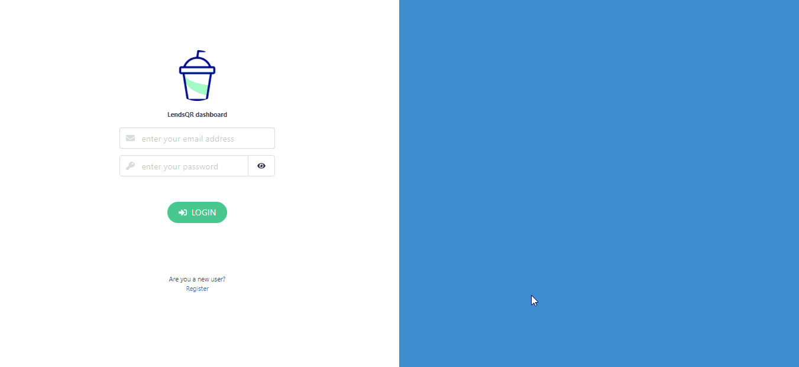

# LendsQR

## Description
Implementation of a wallet System



## Technical Details
This is a mono-repo project for a wallet system. It uses nodejs for the server (`lendsqr` folder) and has aReact frontend (`ui` folder).

### Server
The server runs on express and is only an API. It is not being used to serve the web assets. This design is to enable isolation of concerns and allow the server.

### API
The server exposes the following endpoints which are consumed by the application
| Endpoint        | Description                                            | Method |
|-----------------|--------------------------------------------------------|--------|
| `/users/login`  | Used to login                                          | POST   |
| `/users/create` | Used to create new accounts                            | POST   |
| `/users/me`     | Used to fetch information about the authenticated user | GET    |
| `/account/fund` | Used to add funds into an account                      | POST   |
| `/account/withdraw` | Used to remove funds from an account                      | POST   |
| `/account/transfer` | Used to transfer funds between users                      | POST   |

### How to run

In order to run the application, make sure you have nodejs installed on your machine. If you have node installed, follow these steps to continue:
- Update the config at `./lendsqr/.env` with details of your mysql/mariadb database. The values of interest are:
    ```
    DB_HOST=127.0.0.1
    DB_PORT=3306
    DB_USER=mysqluser
    DB_PASSWORD=''
    DB_DATABASE=lendsqr
    ```
- Enter into the server folder and run `npm install` to install the required dependencies.
- You will need to [install Knex](https://knexjs.org/#Migrations) and run the migration using `knex migrate:latest`.
- Run `npm start` to start the server.
- In the `ui` folder, install all dependencies suing `npm install`.
  - In order to build the frontend project, you need typescript. You can find more info on how to download typescript [here](https://www.typescriptlang.org/download)
- Run the frontend using `npm run start`
  - You can modify the server URL used by the frontend using the configuration file at `./ui/src/lib/config.ts`.

